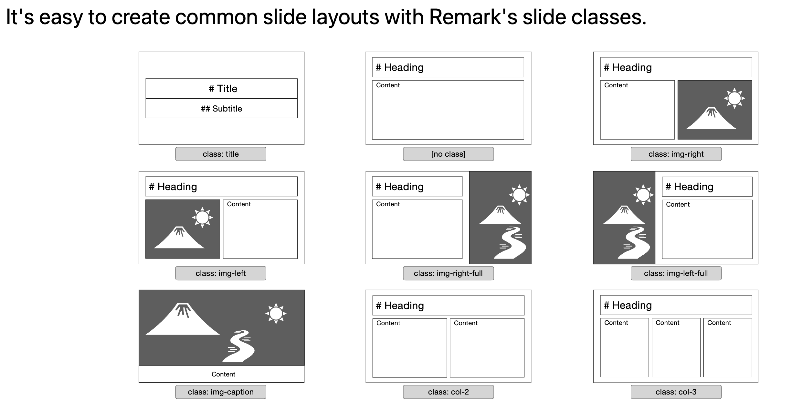

# enablement-interview
Repo to facilitate the presentation and technical exercise for the Enablement Engineer position

<center>

</center>

## HashiCorp Enablement Engineer Technical Exercise

<br>

## Assignment 1 - Slide Presentation

1. Fork this repo

2. Create a new branch to work on.

3. Choose one topic below:

   - [Terraform: Dynamic Credentials with AWS Provider](https://developer.hashicorp.com/terraform/cloud-docs/workspaces/dynamic-provider-credentials/aws-configuration)
   - [Terraform: Output Values](https://developer.hashicorp.com/terraform/language/values/outputs)
   - [Consul: Automated Backups](https://developer.hashicorp.com/consul/docs/enterprise/backups)
   - [Consul: Health Checks](https://developer.hashicorp.com/consul/docs/discovery/checks)
   - [Vault: Token Response Wrapping](https://developer.hashicorp.com/vault/docs/concepts/response-wrapping)
   - [Vault Password Policy](https://developer.hashicorp.com/vault/docs/concepts/password-policies)

4. We have provided an [index.html](index.html), and 3 markdown files ([title.md](title.md), [slide1.md](slide1.md), [slide2.md](slide2.md).) These contain some examples of markdown for classes, images, presenter notes, etc. Create a presentation with 3-7 slides for the topic you chose above. Please make you have at least one example of:

   - Presenter notes
   - Images
   - Code blocks

5. Commit your updates to the branch you created in Step 2

## Assignment 2 - Script

Create a bash script  `setup.sh` that:

- Sets an environment variable with your github username in /root/.bash_profile
- Writes the following code to a file called `config.hcl`

```hcl
cluster_addr  = "https://<HOSTNAME>:8201"
api_addr      = "https://<HOSTNAME>:8200"
disable_mlock = true
````

- Replaces `<HOSTNAME>` value `vault-server.hashicorp.com` in config.hcl

## Additional Information

### Markdown

The presentation is using [remarkjs](https://remarkjs.com/) and the [story](https://github.com/xaprb/story/tree/master) template for display. Story's framework provides predefined layouts for a simple modular way to create custom presentations.

Here are slide classes to choose from for different layouts:


You can review this [index.md](https://raw.githubusercontent.com/xaprb/story/master/exampleSite/content/slides/adirondack/index.md) for more markdown examples that are available for use.

**Local Presenting**

You should be able to present the slides by spinning up a local webserver. There are several options, a few are listed below.

**Live Server in VSCode**
Download the [plugin](https://marketplace.visualstudio.com/items?itemName=ritwickdey.LiveServer) It is a supported VSC plugin so you can run it in VSC directly.

**LiveReload**

`pip3 install livereload` or `brew install livereload`

Navigate to the URL provided

Ex:
```
[I 230221 16:23:52 server:335] Serving on http://127.0.0.1:35729
````

**Simple HTTP Server**
From the command line, navigate to the repository directory:
python3 -m http.server 9000
Navigate to localhost:9000

The following Chrome commands may come in handy:

- SHIFT + C to make a copy of the window
- SHIFT + P to bring up the 'presenter' view if you would like to have notes
