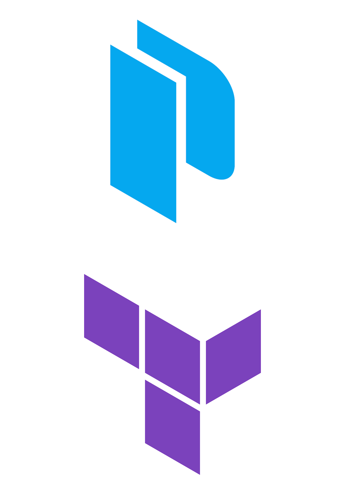

layout: true
class: img-right
background-image: url(../../assets/images/backgrounds/HashiCorp-Content-bkg.png)
background-size: cover
name: slide2

## Benefits of Integrating Packer with Terraform

- Streamlined process

- Improving consistency and repeatability

- Increasing flexibility and portability

- Enhancing security and compliance

- Enabling infrastructure as code

???

- Streamlining the build and deployment process: By using Packer to build custom machine images and Terraform to provision and deploy those images, you can create a streamlined, automated process for building and deploying your infrastructure. This can save time and reduce the risk of errors that can occur when manually building and deploying infrastructure.

- Improving consistency and repeatability: Packer and Terraform both use code to define infrastructure, which makes it easy to create consistent and repeatable builds and deployments. You can version control your infrastructure code and use automated testing to ensure that your infrastructure is consistent and meets your requirements.

- Increasing flexibility and portability: Packer can create machine images for a variety of platforms, including AWS, Azure, Google Cloud, and more. This means you can use Packer to create images for multiple platforms and deploy them with Terraform, making it easier to migrate your infrastructure between cloud providers or between on-premises and cloud environments.

- Enhancing security and compliance: By using Packer to build images with the latest patches and security updates and Terraform to deploy infrastructure with consistent security and compliance configurations, you can enhance the security and compliance of your infrastructure.

- Enabling infrastructure as code: Both Packer and Terraform use a declarative approach to infrastructure, which means you define what you want your infrastructure to look like, and the tools handle the details of creating and managing that infrastructure. This enables infrastructure as code, which provides several benefits, including version control, automated testing, and easier collaboration.

---

