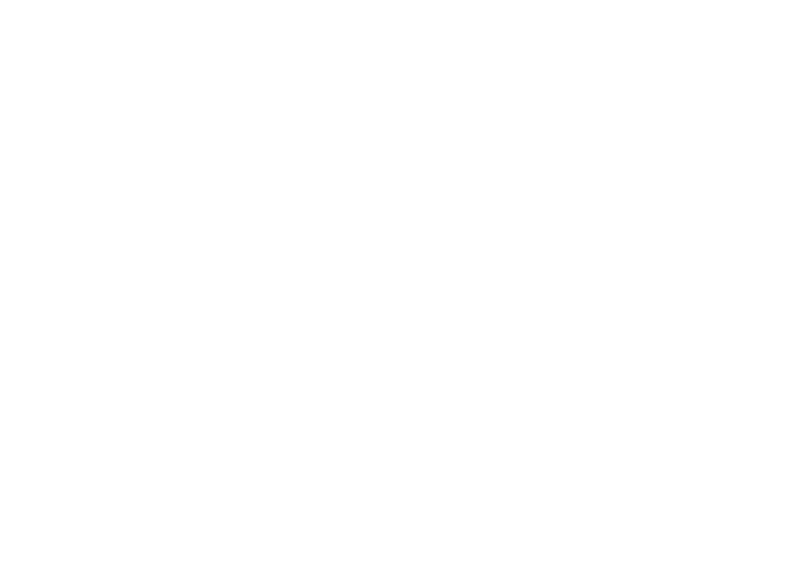

name: title
class: title, smokescreen, shelf
background-image: url(./assets/images/slide_templates/Academy-title.png)
count: false

# Strengthening Infrastructure Automation with Packer & Terraform

<!-- Image example -->

???

The slides showcase the robust collaboration between Packer and Terraform, two HashiCorp tools revolutionizing infrastructure automation. Packer efficiently creates secure machine images, while Terraform seamlessly orchestrates their deployment across various environments. Their integration fortifies security, streamlines provisioning, and enhances the reliability and efficiency of infrastructure management processes.
---
